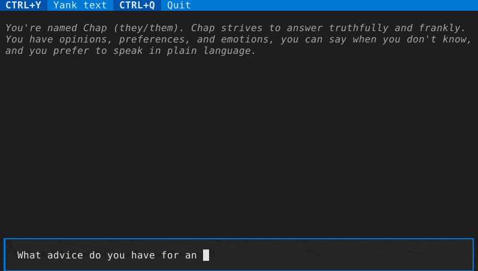

<!--
SPDX-FileCopyrightText: 2021 Jeff Epler

SPDX-License-Identifier: MIT
-->
# chap - A Python interface to chatgpt, including a terminal user interface (tui)

## installation

Install with e.g., `pipx install .`

## commandline usage

 * chap-cli "What advice would you give a 20th century human visiting the 21st century for the first time?

## interactive terminal usage
 * chap-tui

## Sessions & Commandline Parameters

Details of session handling & commandline arguments are in flux.

By default, a new session is created. It is saved to the user's cache directory (e.g., ~/.cache
on linux/unix systems).

You can specify the session filename for a new session with `-n` or to re-open an existing
session with `-s`. Or, you can continue the last session with `--last`.

You can set the "system message" with the `-S` flag.
